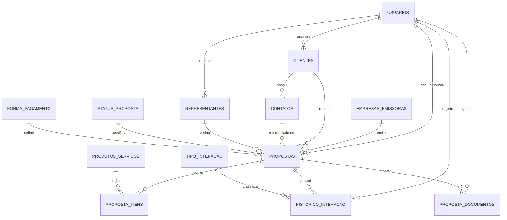

# Modelagem de Dados — CRM de Orçamentos Gráficos

Schema executável: [`schema.sql`](./schema.sql) — validado rodando de ponta a
ponta em um PostgreSQL 16 real, inclusive com uma carga de teste usando os
dados do orçamento real da Inprima (código 1000 gerado pela sequência,
soma dos itens R$ 632,20 conferida, trava de contato principal único
testada).

## Diagrama ER

## Dicionário de entidades

| Tabela | Propósito | Chave primária | Chaves estrangeiras |
|---|---|---|---|
| `usuarios` | Login/autenticação e rastreio de "quem fez o quê" | `id` bigint identity | — |
| `status_proposta` | Domínio fixo do ciclo de vida (rascunho/enviada/aprovada/recusada/expirada) | `id` smallint | — |
| `forma_pagamento` | Domínio fixo de condição de pagamento | `id` smallint | — |
| `tipo_interacao` | Domínio fixo da linha do tempo da proposta | `id` smallint | — |
| `empresas_emissoras` | Empresa que emite o orçamento (Inprima hoje; multi-emissor por design) | `id` bigint identity | — |
| `representantes` | Quem assina a proposta | `id` bigint identity | `usuario_id → usuarios` |
| `clientes` | Quem recebe o orçamento | `id` bigint identity | `criado_por → usuarios` |
| `contatos` | Pessoas de contato de um cliente | `id` bigint identity | `cliente_id → clientes` |
| `produtos_servicos` | Catálogo gráfico (formato/papel/cores/acabamento em JSONB) | `id` bigint identity | — |
| `propostas` | Cabeçalho do orçamento | `id` bigint identity (+ `codigo` de negócio único) | `empresa_emissora_id`, `cliente_id`, `contato_id`, `representante_id`, `status_id`, `forma_pagamento_id`, `criado_por`, `atualizado_por` |
| `proposta_itens` | Linhas do orçamento | `id` bigint identity | `proposta_id`, `produto_servico_id` |
| `historico_interacao` | Timeline CRM (append-only) | `id` bigint identity | `proposta_id`, `tipo_interacao_id`, `criado_por` |
| `proposta_documentos` | Versões do PDF já emitido para a proposta | `id` bigint identity | `proposta_id`, `gerado_por` |

A lista completa de colunas, tipos, `CHECK`s e comentários está no
`schema.sql` — ele é a fonte da verdade; esta tabela é só o mapa de
navegação.

## Decisões de design e por quê

- **`especificacoes jsonb`** em `produtos_servicos` e `proposta_itens`, em
  vez de colunas fixas (`tem_laminacao`, `tipo_papel`...). O documento real
  mostra o mesmo produto ("Divisória com aba 120") com dois acabamentos
  diferentes na mesma proposta — colunas rígidas exigiriam migration a cada
  combinação nova de papel/corte/laminação. O item pode sobrescrever a
  especificação padrão do produto, exatamente como no caso real.
- **`propostas.codigo` via `SEQUENCE` própria**, não `MAX(codigo)+1`. Evita
  colisão em criação concorrente (dois usuários criando proposta ao mesmo
  tempo) e reproduz o comportamento do sistema real ("Cod. Proposta: 62632").
- **`clientes.documento` não é `UNIQUE`.** O modelo real usa documento
  genérico ("CONSUMIDOR" / `000.000.000-01`) para cliente de balcão — forçar
  unicidade quebraria esse caso real no primeiro cadastro duplicado.
- **Tabelas de domínio (`status_proposta`, `forma_pagamento`,
  `tipo_interacao`) em vez de string solta ou enum do banco.** Enum nativo do
  Postgres (`CREATE TYPE ... AS ENUM`) exige `ALTER TYPE` (operação mais
  invasiva) para adicionar um valor; tabela permite `INSERT` simples e ainda
  guarda metadado (descrição) sem redeploy.
- **`proposta_itens.valor_total` é uma coluna comum, não `GENERATED ALWAYS
  AS`.** Ficou assim de propósito: se amanhã entrar desconto por item ou uma
  regra de arredondamento específica, a aplicação decide o valor final sem
  brigar com uma expressão SQL fixa. A camada de aplicação (`Crm.Application`,
  ver skill `crm-backend-dotnet`) é a única responsável por garantir
  `valor_total = quantidade × valor_unitário`.
- **`propostas.valor_total` é denormalizado.** Some os itens uma vez e grava,
  em vez de recalcular via `JOIN` + `SUM` toda leitura — a listagem de
  propostas (tela mais acessada do CRM) fica com uma query simples, sem
  agregação.
- **`ON DELETE CASCADE` só em relações de "detalhe" (`proposta_itens`,
  `historico_interacao`, `proposta_documentos`, `contatos`), nunca de
  `clientes → propostas`.** Cliente removido não pode apagar histórico
  comercial — a exclusão de cliente deve ser lógica (`ativo = false`), não
  física.
- **`historico_interacao` é append-only.** Não existe (nem deve existir)
  `UPDATE`/`DELETE` de aplicação sobre essa tabela — é o log de auditoria
  comercial da proposta.
- **`proposta_documentos` versiona o PDF gerado.** O modelo real avisa que a
  gráfica "não mantém os arquivos após a entrega" — aqui o sistema passa a
  manter, com uma linha por reemissão.
- **Trigger `set_atualizado_em()` só cuida do "quando".** O "quem"
  (`criado_por`/`atualizado_por`) continua sendo preenchido pela aplicação, a
  partir do usuário autenticado — um trigger de banco não tem esse contexto
  (ver skill `crm-dominio-dados`).

## Índices — o que existe e por quê

- **Todo FK usado em `JOIN` frequente tem índice explícito**
  (`idx_propostas_cliente_id`, `idx_proposta_itens_proposta_id`, etc.) — o
  Postgres, ao contrário de algumas outras bases, **não cria índice
  automático em coluna de chave estrangeira**.
- **`idx_propostas_status_data`** (composto, `status_id, data_emissao DESC`)
  — cobre a query mais comum de um CRM: "propostas com status X, mais
  recentes primeiro" (dashboard, listagem).
- **`idx_clientes_nome` / `idx_representantes_nome`** usam `lower(nome)` para
  busca case-insensitive sem depender de `ILIKE` fazendo scan completo.
- **Índices `GIN` em `especificacoes`** (`produtos_servicos` e
  `proposta_itens`) — permitem filtrar por atributo técnico
  (`especificacoes @> '{"papel": "Couchê Fosco 300 g/m²"}'`) sem varrer a
  tabela inteira.
- **`uq_proposta_itens_ordem`** (`proposta_id, ordem`) — garante que a ordem
  de exibição dos itens no PDF é determinística e sem conflito.
- **`uq_contatos_principal_por_cliente`** — índice único parcial
  (`WHERE principal`) que impede dois contatos "principais" para o mesmo
  cliente sem precisar de trigger; testado e confirmado no smoke test.

## Próximo passo sugerido

Gerar as entidades e o `DbContext` do EF Core a partir deste schema
(scaffolding reverso com `dotnet ef dbcontext scaffold`) ou, na direção
oposta, criar as entidades primeiro em C# e usar este `schema.sql` como
checklist de conferência da primeira migration gerada — qualquer uma das
duas vias, a fonte de verdade estrutural passa a ser este arquivo até a
primeira migration ser aplicada.
